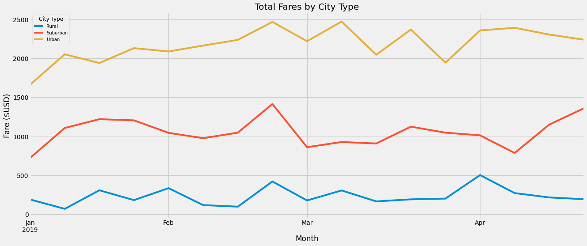
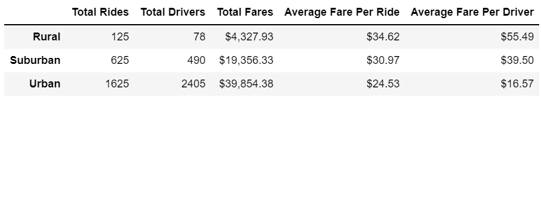

# PyBer_Analysis
---
## Overview
The purpose of this ne analysis is to garner new data and analyze it to support V.Isualize in business decision-making, and strategy. Specifically, this new analysis required us to determine the total ride-sharing fares by city type within a period of time and then further divide this metric by weeks to arrive at the total weekly ride-sharing fare by city type.

As a part of this new analysis we created a final summary visual of the aforementioned metrics, taking the form of a multiple-line graph, as shown below: 

---
## Results
### Summary DataFrame
The total rides, total drivers, and total fares by city type were calculated from the combined ride_data and city_data DF, using the groupby() function in conjunction with both the sum() and count() functions. Further, the average fare per ride and average fare per driver by city type were also calculated using the above three totals by city type. Finally, these individual series were combined into a new DF as seen below:

#### Key Findings
1. The rural cities have the highest average fare per ride and average fare per driver. In my opinion,      this makes sense for a myriad of reasons:
      a. It makes sense for the rural cities to have the highest average fare per ride because firstly            (assuming PyBer's method for determining fare price is adjusted based on their driver supply              and ride demand at any given time) they have the least amount of drivers. Secondly, since Rural          cities are often very spread out, (residential plots, commercial plots, industrial plots, etc.)          it is likely that they would have longer distances to travel when ride-sharing. 
      b. Since they have the least amount of drivers, it makes complete logical sense for the total rural          fare per driver to be the highest since the total driver value is the denominator.
      
2. The urban cities were found to have the lowest average fare per ride and average fare per driver.        Further, I believe this can be attributed to their larger populations assuming once again that            PyBer's method for determining fare price is adjusted based on their driver supply and ride demand        at any given time, and highest total driver count, respectively.
  
3. The total rides : total drivers ratio per city type is ~1.6, ~1.28, and ~0.68 amongst rural,              suburban, and urban city types respectively. Further, the average fare per ride amongst the city          types decreases from highest to lowest in that same order. Therefore, it seems that the higher this      ratio is,(the more rides and less drivers there is in a city type) the average fare per ride              increases. However, it is important to note that correlation does not necessarily mean causation          because I believe that if PyBer were to decrease the amount of drivers in urban cities, the average      fare per ride would probably go up. But, I also believe that total fares would likely decrease            because more customers would resort to alternative methods of transportation at the higher average        fare per ride. So, although this is a finding, I believe more data needs to be compiled and analyzed      alongside this observation to come to any useful implications for the business.
  ---
### Total Fares by City Type Multiple Line Graph
Another DF was created using loc to parse the data to display each city type's weekly fsre metrics from January 1st 2019 to April 28th 2019. Next, the data was resampled into weekly bins after the index was reset to the datetime data type, and then the sum() function was used to get the total fares per week. Finally, the DF was plotted into a multiple line graph as shown below:

* As evidenced above, each city type experienced similar patterns in their total fares over the alloted period.
---
## Summary
#### Reccomendations to V.Isualize
1. Begin collecting additional data such as demographic data like gender and age to potentially uncover micro customer segment trends per city type (how they are similar / how they differ). I believe theis data could lead to findings that could significantly alter future strategy. 
2. Include historical data from past years to enable analysts to assess trends over a longer period of time. I believe having a larger historical sample size would enable PyBer to uncover year-over-year trends which would serve to affirm that these trends are not just happening that year. Further, this would aid PyBer in new long-term strategies.
3. Include the average wait time per customer over the city types. I believe this would open up a whole new window to the business because this metric could be compared with revenue among other variables like average ride fare, over different time periods to determine what is causing peaks and troughs in demand. Further, if any kind of seasonality is consistently indicated in the year-over data, PyBer could more optimally allocate driver resources to maximize profitability.  
